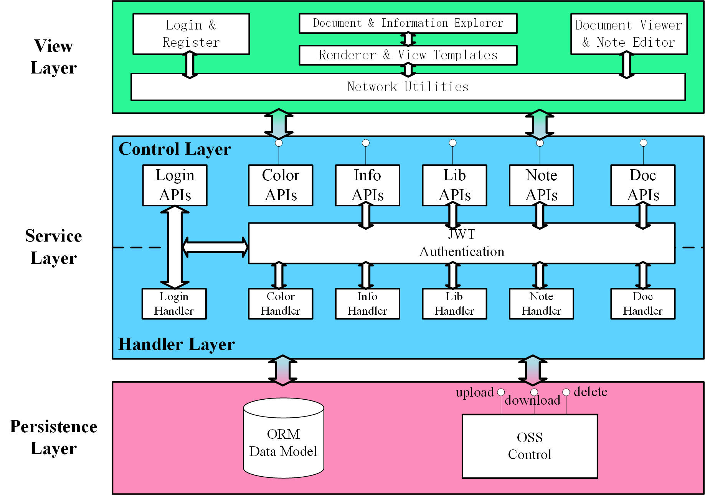
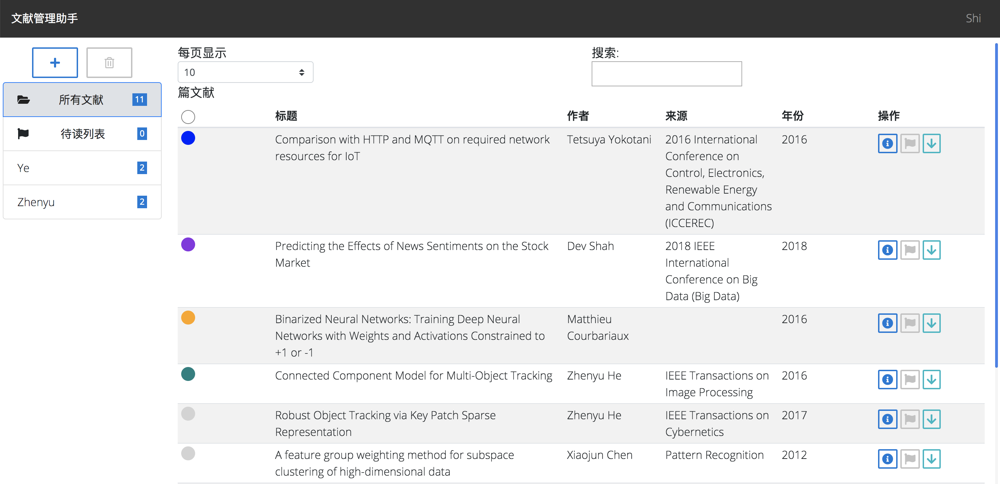
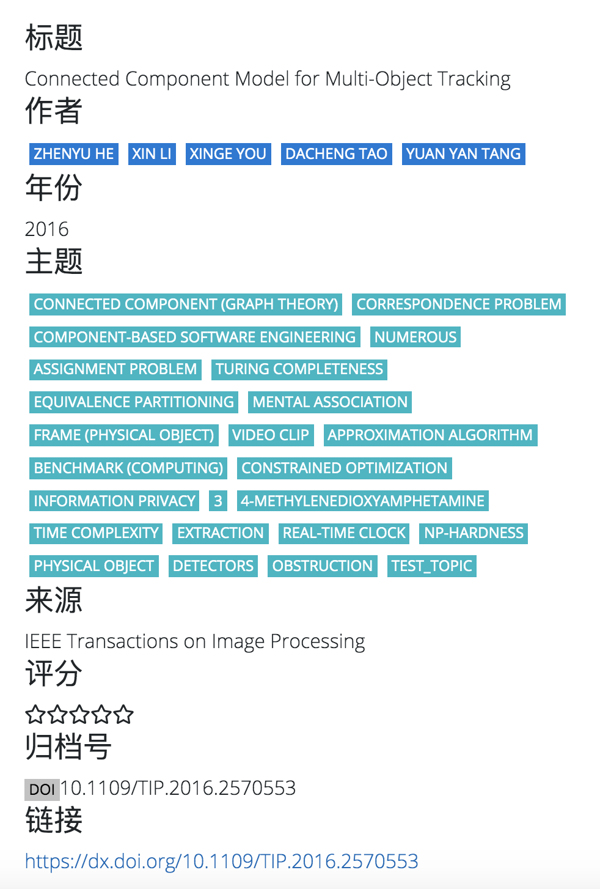
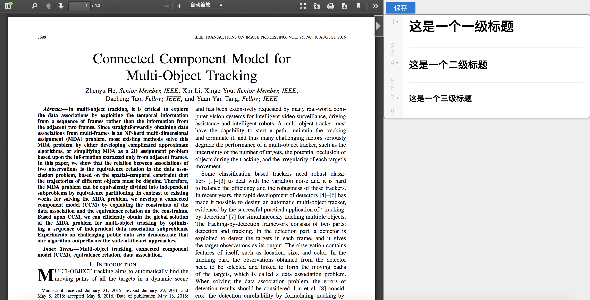

# 学术文献管理系统

学术文献管理助手

## 系统设计



## 框架以及技术

- 后端: flask
- 前端: jquery, bootstrap
- 接口规范: REST
- 数据库服务器：阿里云MongoDB
- 存储服务器：阿里云ECS
- 部署：gunicorn + nginx

## 部署指南

### 克隆到本地

```shell
git clone https://github.com/yup8j/ScholarPaperManagement.git

cd ScholarPaperManagement
```

### mongodb配置

```shell
vim run.py
```

```python
from mongoengine import connect
connect(
    db='',
    host='',
    username='',
    password='',
    authentication_source='',
    authentication_mechanism='',
    replicaset=''
)
```

### oss配置

```shell
vim backend/utils/oss.py
```

参考[阿里云 oss python sdk 指南](https://help.aliyun.com/document_detail/32027.html)

### 后端配置

推荐使用虚拟环境

```shell
(venv) pip install -r requirements.txt
(venv) pip install gunicorn
(venv) gunicorn -c gunicorn.py run:application & > out.log  
```

后端应该正常启动

### 前端配置

#### 克隆前端目录

```shell
cd /usr/share/nginx/html/
git clone https://github.com/forturnme/DoCollet.git
```

#### 配置nginx

```shell
vim /etc/nginx/nginx.conf 
```

配置文件如下

```shell
server {
        listen       80 default_server;
        listen       [::]:80 default_server;
        server_name  _;
        root         /usr/share/nginx/html/DoCollet/;
        include /etc/nginx/default.d/*.conf;

        location / {
	        proxy_set_header X-Forward-For $proxy_add_x_forwarded_for;
	        proxy_set_header Host $http_host;
	        proxy_redirect off;
	        index gateway.html;
	        proxy_cookie_path /insp-web/ /;
	        proxy_cookie_path /insp-web /;
	        if (!-f $request_filename) {
	            proxy_pass http://127.0.0.1:8000;
	            break;
	        }
        }

        error_page 404 /404.html;
            location = /40x.html {
        }

        error_page 500 502 503 504 /50x.html;
            location = /50x.html {
        }
    }


```

启动nginx即可

[Demo地址](http://39.108.137.227/gateway.html)





